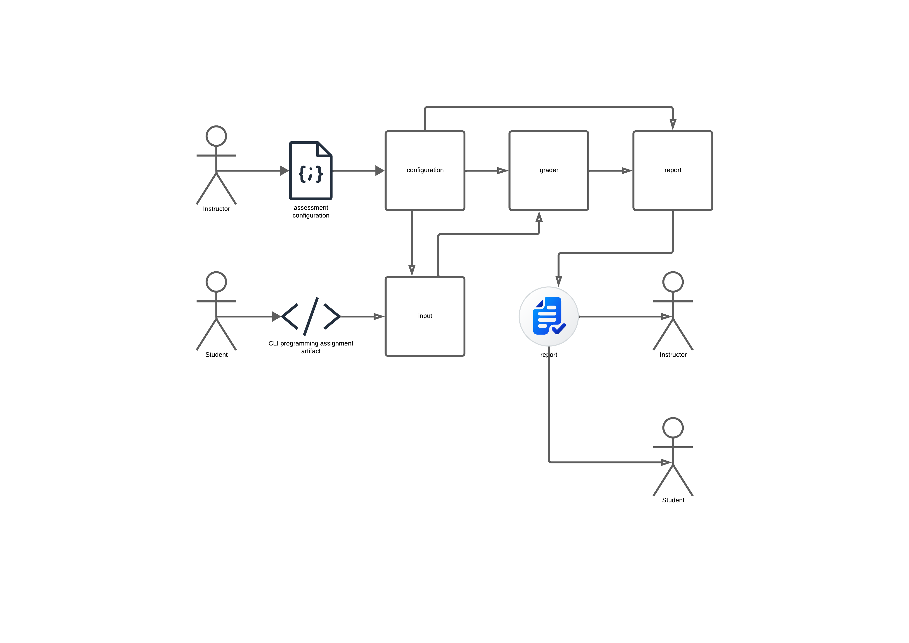

# Description
The goal of this package/bin is to allow instructors/teachers to
automatically assess their students' CLI (command line interface) 
programming assignments.

The CLI-grader will be able to automatically check if the students'
program passed all the tests and it will return a report with the
results. The program must be easy to use at the same time that it has
the possibility of more advanced configuration.


# High Level Complete Specification
This section outlines the project's maximum potential scope. Items found
here may or may not be implemented. 

Being aware of the maximum scope of a project can help during the
development process. Early architectural decisions can help avoiding
unnecessary complexities, given some features will never be implemented,
or embracing the necessary ones, given other features are planned to be
implemented.

Also, given that a detailed and complete specification from the
beginning of a software project is not an easy thing to do, only an
informal and high level specification will be given. Everything here 
related to `how` things should be done is more of a suggestion than a 
requirement.

## Motivation
This tool will be used to **assess programming assignment artifacts** in
the context of programming courses and classes, automating part of the 
process. The program will be fed with a **configuration artifact**,
created by the instructor, and with the student's **CLI assignment
program/source code**, generating a detailed **report artifact** with the
results of the grading process. 

Examples of CLI programs that could be tested by CLI grader:
- **Easy** (basic unit tests with exit status, stdout/stderr validation, 
    simple args): echo, basic calculators, text formatters, simple data 
    converters, hello world variants, unit converters, temperature 
    converter, grade calculator, simple cipher (Caesar), number base 
    converter, BMI calculator, tip calculator, word counter, simple text 
    encryptor/decryptor, text processors (to_uppercase, to_lowercase, etc). 
- **Medium** (timeout handling, random input generation, advanced 
    output parsing, complex args): timer, stopwatch, random generators, 
    basic lexers/parsers, password generator, simple compiler/interpreter
    for basic expressions.
- **Advanced** (state persistence, performance testing, file I/O,
    network operations): cat, grep, find, wc, http clients, file 
    compressors, simple database engines, log analyzers, chess engine, 
    simple version control system, backup utility, network port scanner, 
    basic web server, simple programming language interpreter, data 
    structure and algorithm tool, expense tracker, todo list, contact manager, 
    simple games (guess the number), hangman game, tic-tac-toe, simple 
    chatbot, text-based adventure game, quiz application, maze solver, 
    sudoku validator
- **Very advanced/out of scope** (concurrency, distributed systems, shared
    memory): multi-threaded servers, distributed algorithms, parallel
    processing tools, distributed file system, peer-to-peer client,
    blockchain simulator, distributed consensus algorithms

Obs.: The programs out of scope should not be assessed using this tool.

## Generic Specifications
1. This program will be created to test CLI applications with the focus on
   learning environment, thus, **it is not a professional software testing
   tool**.
2. This application will be **modular** and each module should be decoupled
   from each other as much as possible. 
3. This is a **CLI tool** and building a GUI/TUI is not a priority, even
   though it would not be difficult to add graphical interfaces in the
   future, given that this application is modular and the interface is
   decoupled from the main logic. 
4. The focus will be on the CLI tool, but it will be offered as **lib**
   as well, allowing users to create their customized CLI using the 
   functionality from this crate.
5. **Performance is desirable, but not a priority**.
   - It would be interesting if we have a concurrent environment with
     independent tests running concurrently (and potentially in
     parallel).
6. **Security is highly desirable**, but given that this tool 
   will not run on any production/critical environment, only the necessary 
   for a decent application/crate will be provided, the user must be aware of
   this tool's limitations and must be responsible for any improper use.
   This must be clear to the user. Maybe, a dedicated section in the
   documentation, with suggestions and good security practices.
   - It would be interesting to give the option to execute the tests in a
   sandbox environment.
7. This tool must be **well tested**, specially its critical parts 
   (grading and generating reports). **Correctness** is obviously a crucial 
   requirement. Remember, someone else's grade may be defined by this tool.
8. Although implemented in Rust (🦀❤️), this tool is **agnostic in terms
   of programming languages that were used to compile/interpret the CLI 
   programs which it grades**. 
9. This program grades CLI applications, but it does necessarily need to
   receive them already compiled. It will be able to **automate the
   compilation process of the target programs** too. But, once 
   compiled/interpreted, the behavior of the target program will be as a
   normal CLI application.
   - Main compiled languages supported: C, C++, Rust, Go, TypeScript,
     Dart
   - Main interpreted/bytecode languages supported: Java, Python, JavaScript
10. The **user experience** will also be a priority.
    - This includes good error handling and diagnostics.
11. **Public API** and any obscure/hard part of the source code of this program
    **should be well documented**.

## Structure
The main modules that compose this application are:

- **cli**: this is the cli related part of the application, including the
  entry point (main.rs), its commands, all the structure that will
  orchestrate the application.
  - The cli will be able to grade either one student's program or a **batch 
  of students' programs** at the same time.
- **configuration**: this module will be responsible for parsing the
  input configuration from the instructor. It may parse multiple types
  of inputs: **JSON, YAML and a specific DSL**. After parsing the
  configuration file, it will create a configuration data structure that
  will be used by other parts of the application. Other functions of
  this element are;
  - **Check the correctness** of a configuration file.
  - **Generate a template** for the configuration file.
  - **Generate a public version of a configuration file** which may be used
    by the students to run public tests during the development of the
    assignment.
- **input**: this part is focused on implementing multiple **strategies
  for compiling/interpreting the user input** as source code. It generates
  a command ready to be executed in the tests. For example, if it is a
  python source code, a command like: `python program.py` will be
  provided as the strategy to be used to execute the student's CLI.
  - It will be able to receive a repository url and then clone the code
  - If no specific argument is given, this program should recognize the
    best strategy using some reasonable heuristics: file extension,
    etc. For example: `clgrader conf.json program.py` should
    automatically recognize that the strategy to be used is `python`
  - May also analyze source code to get information that will compose
    the grade. The only thing I can think of is the use of lints. Any
    important rule that is broken, generates a negative score, something
    like that.
- **grader**: This part of the program effectively performs the grading process on
  the student's input program. All the instructions of how to perform
  the tests are in the configuration file.
  It will execute a complete test session, with target programs,
  artifacts, environment variables, name, grading configurations, and
  sections/main section. Each section may have multiple testing
  elements.
  The grading system may be either **absolute (100% or 0%) or weighted**.
  It will allow different strategies for testing the target program.
  - **Unit test**: This is the most simple and fast way to create the
    test cases. It will allow **setup and tear down configurations**. Each
    test case will be ran in isolation and will be focused on only one
    program/command. It will allow easy table testing, including the possibility
    of a template like the following:
    ```json
    {
        "unit_tests":{
            "program1":[
                ["stdin", "stdout"],
                ["in1", "out1"],
                ["in2", "out2"],
                ["in3", "out3"]
            ]
        }
    }
    ```
    The unit test will be enough for a lot of use cases. Any kind of
    assignment of the type: `executable + args -> out` which does not 
    require complex shell interaction will be covered. 
    Another example would be:
    ```json
    {
        "unit_tests":{
            "env": {
                "HOME": "/tmp/student",
                "PATH": "/usr/bin:/bin"
            },
            "program1":[
                {
                    "args": "\"hello  there\"", 
                    "stdout": "hello  there", 
                    "stderr": "", 
                    "status": 0, 
                    "file":{
                        "name":"out.txt",
                        "content":"some content\n..."
                    },
                    "weight":2
                    
                },
                {
                    "args": {
                        "permutations":["arg1", "-arg2 abc"]
                    }, 
                    "stdout": "other example\n", 
                    "exit":{
                        "between":[1, 5]
                    }
                }
            ]
        }
    }
    ```

  - **Integration test**: this kind of test allows a more detailed
    control over the test, allowing intermediate actions and checks. One
    example:
    ```json
    {
        "integrated_tests":{
            "stop_if_fail":true,
            "steps":[
                "command1 arg1 arg2 > file.txt",
                {
                    "program":"program1",
                    "args": "other example\n", 
                    "stdout": "other example\n",
                    "timeout":"5s"
                },
                "command1 arg1 arg2 > file.txt",
                {
                    "program":"program1",
                    "args": "other example\n", 
                    "stdout": {
                        "regex":"abc[a|b]+cde"
                    },
                    "weight":5
                }
            ]
        }
    }
    ```
    I believe most of the CLI programs that would be tested in a
    programming assignment class would be testable using
    `integration_test`.
  - **Performance test**: This test is only focused on benchmarking the
    performance of the input program:
    ```json
    {
        "performance_tests":{
            "program1": {
                "memory_limit": "256MB",
                "time_limit": "5s",
                "cpu_limit": "100%",
                "benchmarks": [
                    {
                        "name": "small_input",
                        "args": "input1.txt",
                        "expected_max_time": "100ms",
                        "expected_max_memory": "50MB",
                        "weight": 1
                    },
                    {
                        "name": "large_input", 
                        "args": "large_input.txt",
                        "expected_max_time": "2s",
                        "expected_max_memory": "200MB",
                        "weight": 3
                    }
                ],
                "stress_test": {
                    "enabled": true,
                    "iterations": 100,
                    "input_generator": "random_data.py",
                    "stability_threshold": 0.95
                },
                "profiling": {
                    "enabled": true,
                    "tools": ["valgrind", "perf"],
                    "memory_leaks": "fail_on_leak"
                }
            }
    

        }
    }
    ```
  Upon finishing the execution of the tests, this component will send
  the generated information for the report component.
  - During the execution, it will generate logging information.

- **report**: the report module will be responsible for the **generation
  of the final report of the student**. It will use the data from the
  grade component and it will be guided by the specifications in the
  configuration. It will allow the representation in multiple formats:
  **textual to stdout (default), txt, markdown, pdf**. Also, it will allow
  the **verbose, non-verbose, only-score** mode.
  The structure of the report will be based on the structure of the
  configuration file and the verbosity.

# Requirements
This part of the document contains a more detailed and formal
specification and will be the main guide for the implementation.

## Part 1
In the end of this part, you will have a very simple, but functional
version of the application. Only a limited subset of the application
will be implemented. The focus here will be on breadth instead of depth.

1. **cli**: 
    - [ ] Create all the basic structure for the CLI: lexer/parser,
      commands structure, etc. Some libs that may be helpful: clap,
      clap-derive.
    - [ ] Command **help**: it will be called by using arguments `-h`
      or `--help` and must print to stdout the basic help message:
      ```txt
      Usage: clgrader <CONFIGURATION_FILE> <TARGET_PROGRAM>
      Grade TARGET_PROGRAM using the specification of CONFIGURATION_FILE.
      ```
    - [ ] Implement the basic usage command: `clgrader <CONFIGURATION_FILE> <TARGET_PROGRAM>`.
      In other words, this will be the complete orchestration of each
      component implemented in this stage.
    - [ ] Implement logging (not for programmers, something more visual:
      progress bar, checks, colors, etc), specially on grading process. 
      Crates to look: indicatif, console. 

2. **configuration**: 
    - [ ] Implement a parser for the configuration files which will be
      written in JSON format. The specification of the configuration (not
      necessarily in JSON) is:
      ```
      - title: string
      - [author]:string
      - [logging_mode]: "silent" | "normal" (default) | "verbose"
      - [grading]:{
        - [mode]: "absolute" | "weighted" (default)
      } 
      - [report]:{
        - [is_verbose]: bool (default: false)
        - [output]: from {"txt", "stdout" (default)}
      }
      - [input]:{
        // At the moment, only this option will be available   
        - [target_program]: string (default:target)
      }

      - sections:{
        - <section_name>+:{
            // Each section may have a base weight.
            [weight]:int,
            // Must not be empty 
            - unit_tests:{
                [env]: {
                    <env_variable_name:string>+: string,
                }
                [setup]: [
                    <command>+,
                ]
                [teardown]:{
                    <command>+,
                }
                // Table test:
                - <program_name>*:[
                    // The header is a list of possible unit test
                    // elements. Each unit test of this list will follow
                    // the header convention. The header must not have
                    // duplicate elements.
                    // Example: ["args", "stdout", "weight"]
                    - (list)[<header_element: "args", "stdout", "stderr", "status", "weight", "name" >+],
                    // The test values must be filled based on the
                    // header. 
                    // Example: 
                    // ["args", "stdout", "weight"]
                    // ["arg1", "res1", "1"]
                    // ["arg2", "res2", "2"]
                    // ["arg3", "res3", "3"]
                    - (list)[<test_values: "args":string, "stdout":string, "stderr":string, "status":int, "weight":int, "name":string >+],
                ]

                // Detailed test:
                - <program_name>*:[
                    {
                        [name]:string,
                        [args]:string,
                        [stdout]:string,
                        [stderr]:string,
                        [status]:int,
                        [weight]:int,
                    }+
                ]

            },
        }
        
      }
      ```
Below, we have a table with all the 

| Symbol | Meaning | Example |
|--------|---------|---------|
| `[field]` | **Optional field** | `[author]` - author field is optional |
| `field` | **Required field** | `title` - title field is mandatory |
| `field*` | **Zero or more** | `unit_tests*` - can have 0+ unit tests |
| `field+` | **One or more** | `<command>+` - requires at least 1 command |
| `<name>` | **key** | `<section_name>` - a key for a value|
| `"val1" \| "val2"` | **Enum options** | `"absolute" \| "weighted"` - must be one of these |
| `(default)` | **Default value** | `"normal" (default)` - uses "normal" if not specified |
| `(list)` | **Array/list structure** | Table test rows are arrays |
| `{}` | **Object/nested structure** | Contains sub-fields |
| `[]` | **Array structure** | List of items |

3. **input**: This module, at this stage, will be very simple. The only
   type of input that will be accepted is **executable**. Thus, there
   will be no **compilation** or **interpretation** at this point.
   Also, no heuristics will be implemented yet, it will assume the file
   is an executable.
    - [ ] Implement the functionality for validating the executable
      input. The user will input the path for the executable as argument for the
      CLI, which will be passed to this module, which will validate the
      executable (File exists, readable, executable permissions, not 
      directory, not empty,  path length limits)

4. **grading**: Only the unit testing functionality will be implemented
   at this stage.
    - [ ] Implement the functionality for grading the user program given
      a configuration file described in `Part1.2`. In this step, the
      `assert_cmd` crate may be very helpful.
    - [ ] Implement both **absolute** and **weighted** mode for grading. 
        - **absolute**: the user will get 100% of the score only if
          **all tests are passed**.
        - **weighted**: each test will have a weight (defaults to 1, if
          not specified) and the final score will be the sum of weights of
          tests passed. The minimum is 0 and the maximum is the sum of
          weights of all tests.
5. **report**: after grading, this module will be responsible for
   generating the final report.
    - [ ] Generate report that will be printed to **stdout** or **txt**
      file. The report may be verbose or not.
6. **Generic requirements**: 
    - [ ] Implement logging
    - [ ] Implement error handling
    - [ ] Add documentation for public API


